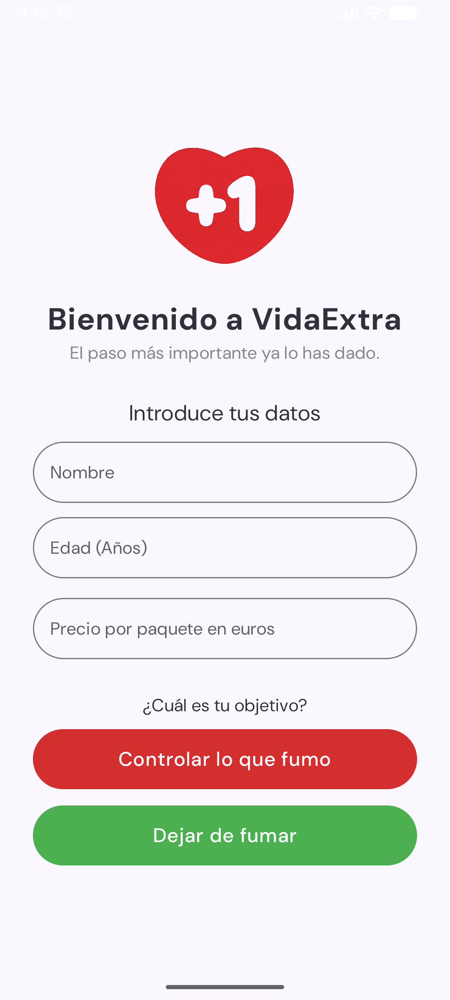
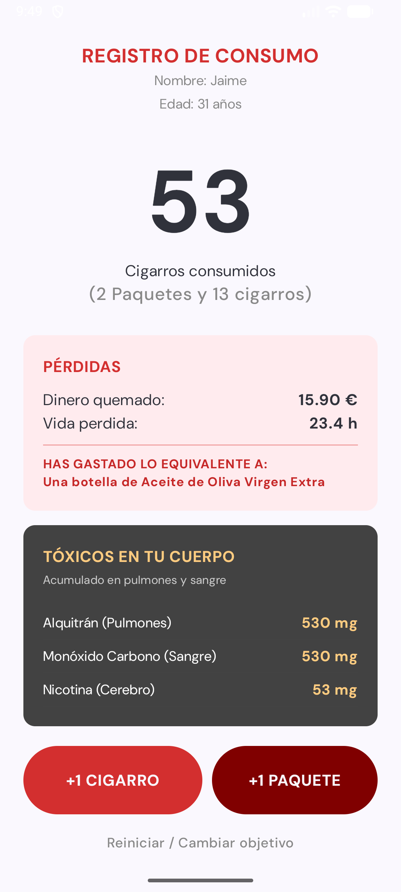

# VidaExtra - Android Native App

Proyecto de desarrollo móvil nativo realizado como parte del ciclo formativo de Desarrollo de Aplicaciones Multiplataforma (DAM).

La aplicación es un gestor de hábitos enfocado en la salud (seguimiento para dejar de fumar). El objetivo principal del proyecto ha sido implementar una arquitectura moderna y escalable, alejándome del sistema de Vistas clásico (XML) para utilizar el estándar actual de la industria.

## Stack Tecnológico

He desarrollado la aplicación utilizando **Kotlin** como lenguaje principal y las siguientes librerías de Android Jetpack:

* **Jetpack Compose:** Diseño de interfaz declarativa (UI). Sin uso de XML.
* **Architecture Components (MVVM):** Separación de lógica de negocio y UI mediante el patrón Model-View-ViewModel.
* **Room Database:** Abstracción de SQLite para la persistencia de datos local. Uso de Entidades y DAOs.
* **Kotlin Coroutines & Flow:** Gestión de operaciones asíncronas y flujos de datos reactivos desde la base de datos hacia la interfaz.
* **StateFlow:** Gestión del estado de la UI.

## Estructura del Proyecto

El código está organizado siguiendo los principios de Clean Architecture simplificada:

* `data/`: Contiene la configuración de la base de datos (`AppDatabase`), los objetos de acceso a datos (`UsuarioDao`) y las entidades.
* `ui/`: Contiene las pantallas construidas con funciones Composable y los ViewModels que gestionan el estado.
* `model/`: Lógica de negocio y modelos de datos.

## Funcionalidades Implementadas

1.  **Persistencia Local:** La aplicación almacena el progreso del usuario (cigarrillos evitados, dinero ahorrado) en el dispositivo utilizando Room.
2.  **Interfaz Reactiva:** Los cambios en la base de datos se reflejan automáticamente en la interfaz gracias a la observación de flujos de datos.
3.  **Gestión de Estado:** Uso de `StateHoisting` para mantener la lógica fuera de los componentes visuales.

## Instalación y Ejecución

Para probar el proyecto:

1.  Clonar el repositorio:
    ```bash
    git clone [https://github.com/JaimeFontan/VidaExtra.git](https://github.com/JaimeFontan/VidaExtra.git)
    ```
2.  Abrir en **Android Studio Koala** (o superior).
3.  Sincronizar el proyecto con Gradle.
4.  Ejecutar en un emulador (API 26+) o dispositivo físico.

## 📸 Capturas de pantalla

Aquí se muestra el funcionamiento de la App:

<div style="display: flex; gap: 10px;">
  
  
  
</div>

## Autor

**Jaime Fontán**
Estudiante de 2º de DAM | Desarrollador de Software
www.linkedin.com/in/jaimefontang

